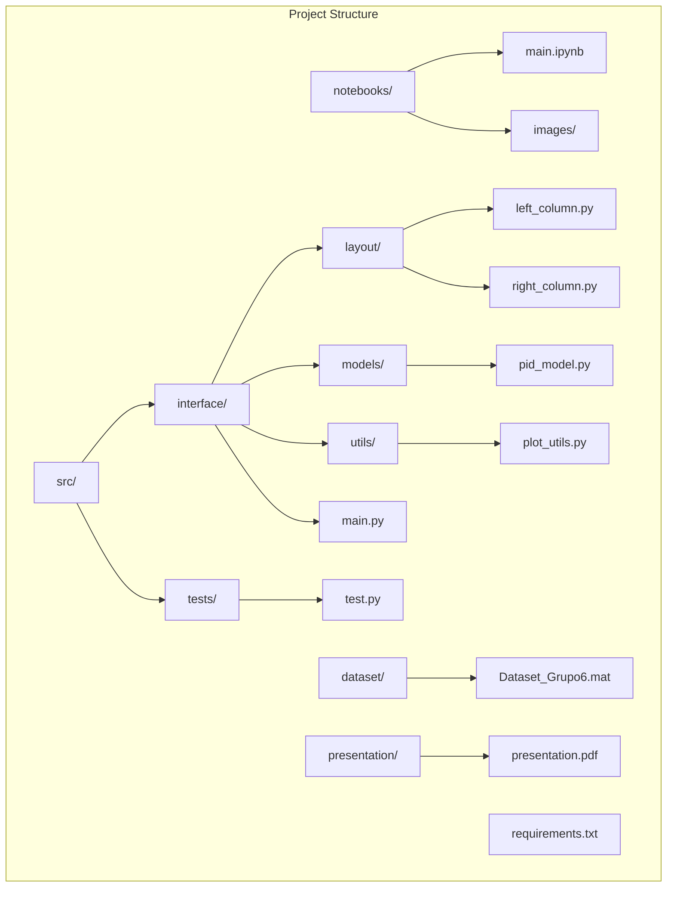

# C213-trabalho-1

Repository dedicated to storing and managing the first assignment for **C213 - embedded systems**.

## Overview
The interface was developed using `Streamlit` to demonstrate the usage of a PID controller in a circuit. The project is built with `Python 3.9`.

## Index

- [Project struct](#project-struct)
- [Cloning the Repository](#cloning-the-repository)
- [Creating and Activating the Virtual Environment](#creating-and-activating-the-virtual-environment)
- [Installing the Requirements](#installing-the-requirements)
- [Running the Project](#running-the-project)
- [Authors](#authors)

## Project struct



- **`/notebooks/`**: Directory containing Jupyter notebooks used for experimentation, data visualization, and initial development. This directory also includes the `images/` folder, where the plots and graphs generated by the notebooks are stored.
    - **`main.ipynb`**: The main notebook of the project, used for experimentation and initial visualizations.
    - **`/images/`**: Folder that stores the plots and graphs generated during the analysis in the notebook.

- **`/src/`**: Directory that contains the application's source code.
    - **`/interface/`**: Contains the code related to the project’s graphical interface.
        - **`/layout/`**: Defines the structure and visual elements of the interface.
            - **`left_column.py`**: Code responsible for the components and layout of the left column in the interface.
            - **`right_column.py`**: Code that defines the elements and functionalities of the right column.
        - **`/models/`**: Contains the mathematical models and calculations used in the application.
            - **`pid_model.py`**: Implements functions for specific calculations related to the PID model (or other calculations used in the project).
        - **`/utils/`**: Helper functions that support the interface and application.
            - **`plot_utils.py`**: Functions for generating and managing plots and visualizations.
        - **`main.py`**: Main file that coordinates the execution of the interface and integrates different modules.

    - **`/tests/`**: Directory to store unit and integration tests for the application.
        - **`test.py`**: Contains tests to validate the behavior and functionality of the application's different modules.

- **`/dataset/`**: Folder that stores the data files used in the project.
    - **`Dataset_Grupo6.mat`**: Main data file of the project, likely containing information in MATLAB format (.mat) for analysis.

- **`/presentation/`**: Contains the PDF file of the presentation delivered on the presentation day.

    - **`presentation.pdf`**: PDF of the project presentation.

- **`requirements.txt`**: File listing all dependencies and libraries required to run the project, enabling easy environment setup using `pip`.


## Cloning the Repository

To get started, clone this repository to your local machine. Run the following command in the directory where you want to save the repository:

```bash
git clone https://github.com/matheusAFONSECA/C213-trabalho-1.git
```

## Creating and Activating the Virtual Environment

A Python interpreter must be previous installed on your machine to create and activate the virtual environment. There are two ways to set up the virtual environment:

### 1 - Using Commands

To create a virtual environment in your repository, run the following command:

```bash
python -m venv C213venv
```

After creating the virtual environment, activate it with the following command:

```bash
.\C213venv\Scripts\activate
```

### 2 - Using a script

Alternatively, you can use one of the scripts provided in the `scripts` directory to automate the setup:

- **Windows:**

```bash
.\scripts\create_and_activate_venv.ps1
```

- **Linux or macOS:**

```bash
./scripts/create_and_activate_venv.sh
```

## Installing the Requirements

Once the virtual environment is active, install the required dependencies by running the following command:

```bash
pip install -r requirements.txt
```

## Running the project

To run the application, you'll need to run the following command in the terminal:

```bash
streamlit run src/interface/main.py
```

## Authors

### [Matheus Fonseca](https://github.com/matheusAFONSECA)

Undergraduate student in the eighth (8th) semester of Computer Engineering at the National Institute of Telecommunications (Inatel). I participated in a Scientific Initiation at the Cybersecurity and Internet of Things Laboratory (CS&ILAB), where, in the Park Here project, I developed skills in computer vision applied to parking systems, focusing on license plate recognition and vehicle identification. Additionally, I served as a teaching assistant for Physics 1, 2, and 3, helping with practical classes, report writing, and answering theoretical questions. Currently, I am an intern at the Inatel Competence Center (ICC) in the PDI SW department.

## [Davi Rosa](https://github.com/DaviRGomes)
Computer Engineering student at Inatel, currently in the 8th semester. At 21 years old, I am completing my degree, focused on gaining practical experience and specializing in an area related to the course I am finishing.
